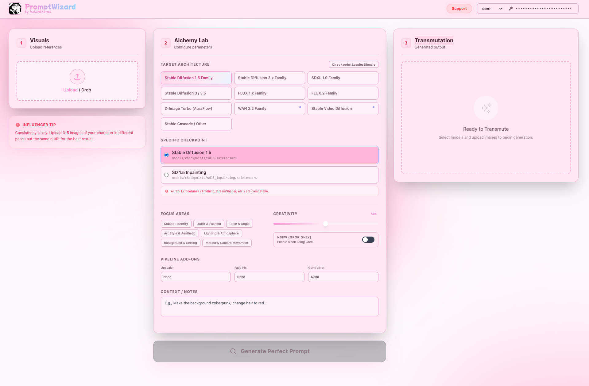

# PromptWizard (FastAPI + HTMX)

PromptWizard is a local, browser-based prompt engineering tool that analyzes reference images and generates high-quality prompts for image/video diffusion models. It ports the original React UI into a FastAPI + HTMX + Tailwind workflow while keeping the same smooth, single-page experience.

## What it is built for
- Quickly craft strong prompts from 1–6 reference images.
- Target specific model families/checkpoints (SD 1.5, SDXL, SD3, Flux, Wan, etc.).
- Tune creative direction using focused aspects, creativity level, and auxiliary pipeline add-ons.
- Use Gemini, OpenAI, or Grok as the captioning engine with per-provider API keys.

## Install (uv only)
Requires Python 3.11+.

```bash
uv sync
```

## Run
```bash
uv run uvicorn main:app --reload
```

Then open `http://127.0.0.1:8000`.

## How to use the UI
The interface is split into three columns:

1) Visuals (left)
- Upload or drag and drop up to 6 images.
- These images are sent to the selected provider for analysis.

2) Wizard Lab (center)
- Target Architecture: choose the model family to tailor prompt structure.
- Specific Checkpoint: select the exact checkpoint within the family.
- Focus Areas: emphasize aspects like Subject, Outfit, Style, Lighting, etc.
- Creativity: adjust how loosely or strictly the model follows the reference.
- Pipeline Add-ons: optional upscaler, face fix, or ControlNet hints.
- Context / Notes: add custom instructions (e.g., setting, color shifts).
- NSFW (Grok only): UI toggle only for now (no backend logic yet).

3) Transmutation (right)
- Displays the generated prompt and optional negative prompt.
- Includes copy-to-clipboard buttons.

Top-right key bar:
- Choose Gemini/OpenAI/Grok and paste your API key.
- Keys are stored in LocalStorage for the session and persisted to `.env`.
- On refresh/restart, the UI loads the key from `.env` if present.

## How UI changes affect the prompt
- Model family and checkpoint determine prompt structure and guidance.
  - Example: Flux expects natural language, SD 1.5 expects tags, video models expect motion descriptions.
- Focus Areas add explicit detail requests for selected aspects.
- Creativity adjusts model temperature: `temperature = 0.2 + (creativity_level * 0.6)`.
- Auxiliary add-ons add specialized guidance:
  - ControlNet: emphasizes pose/structure clarity.
  - Upscaler: pushes high-frequency detail.
  - Face Fix: reinforces facial identity.
- Additional Context is appended as direct instruction for the prompt.

## Notes
- Keys persist in `.env` and are reloaded into the UI on refresh.
- LocalStorage is reset per app instance to avoid stale key reuse.
- All prompt generation happens server-side through the selected provider API.
